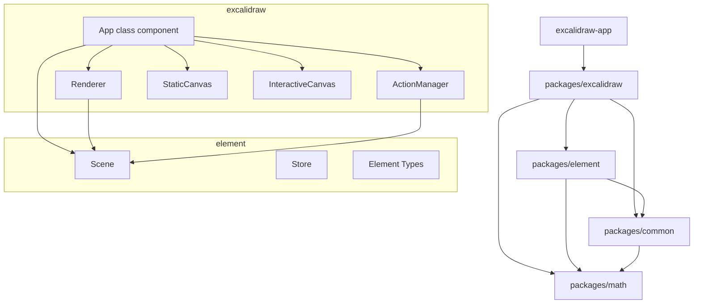

# Excalidraw Architecture

## High-level Architecture

The project is a Yarn-workspace monorepo with five packages and one standalone app:

| Package | Version | Role |
|---------|---------|------|
| `packages/excalidraw` | 0.18.0 | Core React component, actions, rendering |
| `packages/element` | 0.18.0 | Element types, Scene class, Store |
| `packages/common` | 0.18.0 | Shared constants, utilities, types |
| `packages/math` | 0.18.0 | Vector math and geometry |
| `packages/utils` | 0.1.2 | Export and clipboard utilities |
| `excalidraw-app` | — | Standalone web app (uses `packages/excalidraw`) |

Key runtime dependencies: React 19, Jotai 2.11 (atoms), RoughJS 4.6 (sketch rendering), Socket.io 4.7 (collaboration), Vite 5 (build).



### Component tree

```text
[ExcalidrawAPIProvider]    # optional external wrapper — exposes useExcalidrawAPI() outside <Excalidraw>
  <Excalidraw>             # public API wrapper (index.tsx)
    <ExcalidrawBase>       # prop normalization (props.tsx)
      <InitializeApp>      # async init (fonts, device detection)
        <EditorJotaiProvider># isolated Jotai store
          <App>            # class component — all core logic
            <StaticCanvas>
            <InteractiveCanvas>
            <NewElementCanvas>
            <SVGLayer>     # hyperlinks, arrow markers
            <LayerUI>      # toolbar, sidebar, menus
```

---

## Data Flow

### User interaction → state update → render

```text
Pointer/Keyboard Event on canvas
        │
        ▼
App.handleCanvasPointerDown() / keyboard handler
        │
        ▼
ActionManager.executeAction(action)          ← keyboard shortcuts
  └─ action.perform(elements, appState, value, app)
        │ returns ActionResult
        ▼
App.syncActionResult(ActionResult)
  ├─ App.updateScene({ elements, appState, captureUpdate })
  │     ├─ this.setState(appState)           → React re-render
  │     ├─ scene.replaceAllElements(elements)
  │     └─ store.scheduleMicroAction(captureUpdate)
  └─ emits onChange callback
        │
        ▼
App.render()
  ├─ renderer.getRenderableElements(viewport)
  ├─ <StaticCanvas>  → renderStaticSceneThrottled()
  └─ <InteractiveCanvas> → renderInteractiveScene()
```

### Remote / collaboration update

```text
Socket.io message (remote delta)
        │
        ▼
app.applyDeltas(deltas)
  ├─ StoreDelta.squash()     — aggregate incoming deltas
  ├─ StoreDelta.applyTo()    — patch elements + appState
  └─ scene.replaceAllElements()
        │
        ▼
triggerRender() → setState({})
```

### Action result capture for history

```text
CaptureUpdateAction.IMMEDIATELY  → record undo snapshot now
CaptureUpdateAction.EVENTUALLY   → batch with next action
CaptureUpdateAction.NEVER        → skip (remote update, init)
```

---

## State Management

### AppState (React component state)

`App` is a class component. Its state is typed as `AppState` (`packages/excalidraw/types.ts`). Selected fields by category:

```typescript
// Canvas viewport
zoom: { value: number }
scrollX: number
scrollY: number
width: number
height: number

// Active tool
activeTool: { type: ToolType; locked: boolean; fromSelection: boolean }

// In-progress element creation
newElement: NonDeletedExcalidrawElement | null
resizingElement: NonDeletedExcalidrawElement | null
multiElement: NonDeletedLinearElement | null

// Selection
selectedElementIds: Record<string, true>
selectedGroupIds: Record<string, true>
selectedLinearElement: { elementId: string; isEditing: boolean } | null
hoveredElementIds: Record<string, true>

// Style defaults applied to newly created elements
currentItemStrokeColor: string
currentItemFillStyle: FillStyle
currentItemFontFamily: FontFamilyValues
currentItemArrowType: ArrowType
// ... ~20 more currentItem* fields

// UI dialogs / menus
openDialog: { name: string } | null
openSidebar: string | null
contextMenu: { items: ContextMenuItem[]; top: number; left: number } | null

// Collaboration
collaborators: Map<SocketId, Collaborator>

// View flags
theme: "light" | "dark"
viewModeEnabled: boolean
zenModeEnabled: boolean
gridModeEnabled: boolean
```

Default values live in `packages/excalidraw/appState.ts` (`getDefaultAppState()`).

### Observable subset (Store / undo-redo)

Only a reduced slice — `ObservedAppState` — is captured by the Store:

```typescript
ObservedAppState {
  name: string
  viewBackgroundColor: string
  editingGroupId: string | null
  selectedElementIds: Record<string, true>
  selectedGroupIds: Record<string, true>
  selectedLinearElement: { elementId: string; isEditing: boolean } | null
  croppingElementId: string | null
  lockedMultiSelections: boolean
  activeLockedId: string | null
}
```

### Jotai atoms (`editor-jotai.ts`)

An isolated Jotai `createStore()` is created per editor instance inside `<EditorJotaiProvider>`. Atoms used for targeted subscriptions that bypass full React re-renders (e.g., popover visibility, sidebar state).

### Context providers

| Context | Value type | Consumer |
|---------|-----------|----------|
| `ExcalidrawAppStateContext` | `AppState` | Components reading state |
| `ExcalidrawSetAppStateContext` | `setState` callback | Components updating state |
| `ExcalidrawElementsContext` | `NonDeletedExcalidrawElement[]` | Components reading elements |
| `ExcalidrawActionManagerContext` | `ActionManager` | Components dispatching actions |
| `ExcalidrawAPIContext` | `ExcalidrawImperativeAPI` | External consumers |
| `EditorInterfaceContext` | device / UI flags | Layout-aware components |

### ActionManager (`packages/excalidraw/actions/manager.tsx`)

```typescript
class ActionManager {
  actions: Record<string, Action>

  registerAction(action: Action): void
  handleKeyDown(event: KeyboardEvent): boolean
  executeAction(action, source, value?): void
  // calls action.perform(elements, appState, value, app)
  // then passes result to this.updater()
}
```

45+ action files under `packages/excalidraw/actions/` (align, copy, delete, distribute, group, history, zoom, …).

---

## Rendering Pipeline

### Two-canvas split

`App.render()` mounts two `<canvas>` elements on top of each other:

| Canvas | Component | Content |
|--------|-----------|---------|
| Static | `<StaticCanvas>` | Background grid, all non-interactive elements |
| Interactive | `<InteractiveCanvas>` | Selection handles, transform handles, snap lines, collaborator cursors |

A third temporary canvas (`<NewElementCanvas>`) renders the element currently being drawn.

### Renderer class (`packages/excalidraw/scene/Renderer.ts`)

Computes which elements are visible given the current viewport before passing them to canvas renderers:

```typescript
class Renderer {
  getRenderableElements(viewport: {
    zoom, scrollX, scrollY, offsetLeft, offsetTop,
    width, height, editingTextElement, newElementId, sceneNonce
  }): {
    elementsMap: RenderableElementsMap      // id → element
    visibleElements: NonDeletedExcalidrawElement[]
  }
}
```

`sceneNonce` (an integer bumped on every Scene mutation) is used as a cache key so that `getRenderableElements` can skip recomputation when nothing changed.

### Static scene (`packages/excalidraw/renderer/staticScene.ts`)

```text
renderStaticSceneThrottled(config: StaticCanvasRenderConfig)
  └─ bootstrapCanvas()          — scale for devicePixelRatio, clear rect
  └─ strokeGrid()               — draw background grid lines
  └─ for each visibleElement:
       renderElement(element, elementsMap, renderConfig, rc)
         ├─ RoughCanvas (rc)    — sketch-style paths via RoughJS
         └─ Canvas 2D API       — text, images, frame overlays
```

### Interactive scene (`packages/excalidraw/renderer/interactiveScene.ts`)

Called on every pointer move; draws:
- Selection bounding-box and corner / edge transform handles
- Linear element midpoint handles and endpoint arrows
- Binding preview highlights
- Snap indicator lines
- Collaborator cursors and name badges (`renderRemoteCursors()`)

### Element rendering (`renderElement`)

Each element type has a dedicated draw path:

| Type | Renderer |
|------|----------|
| rectangle / diamond / ellipse | RoughJS `rc.path()` |
| arrow / line | RoughJS `rc.path()` with arrowhead geometry |
| freedraw | Canvas `bezierCurveTo()` |
| text | Canvas `fillText()` with font metrics |
| image | Canvas `drawImage()` (from `BinaryFiles` cache) |
| frame | Clip region + child element rendering |
| embeddable / iframe | Positioned `<iframe>` outside canvas |

---

## Package Dependencies

### Import graph (production)

```text
packages/math
    ↑
packages/common
    ↑
packages/element   (imports common, math)
    ↑
packages/excalidraw (imports element, common, math)
    ↑
excalidraw-app      (imports excalidraw)
packages/utils      (imports excalidraw — export helpers)
```

### `packages/element` exports consumed by `packages/excalidraw`

- `Scene` — element storage, queries, mutation
- `Store` / `StoreDelta` — observable change capture
- All element type definitions (`ExcalidrawElement` and subtypes)
- Element utility functions: `mutateElement`, `newElement`, `getBoundingBox`, `getCommonBounds`, binding helpers, linear element helpers

### `packages/common` exports consumed by both

- `KEYS`, `EVENT`, canvas constants
- Color palettes, font constants
- Shared utility functions (`arrayToMap`, `throttle`, etc.)

### `packages/math` exports

Pure vector / geometry functions with no React or DOM dependencies — used by element hit-testing, snap calculation, and linear element path math.

### External dependency roles

| Dependency | Used in | Purpose |
|------------|---------|---------|
| `roughjs` | `packages/excalidraw` | Sketch-style path generation |
| `jotai` | `packages/excalidraw` | Scoped atom-based state |
| `socket.io-client` | `excalidraw-app` | Real-time collaboration transport |
| `codemirror` | `packages/excalidraw` | Code block element editor |
| `i18next` | `packages/excalidraw` | UI string localization |
| `browser-fs-access` | `packages/excalidraw` | File open/save via File System Access API |
