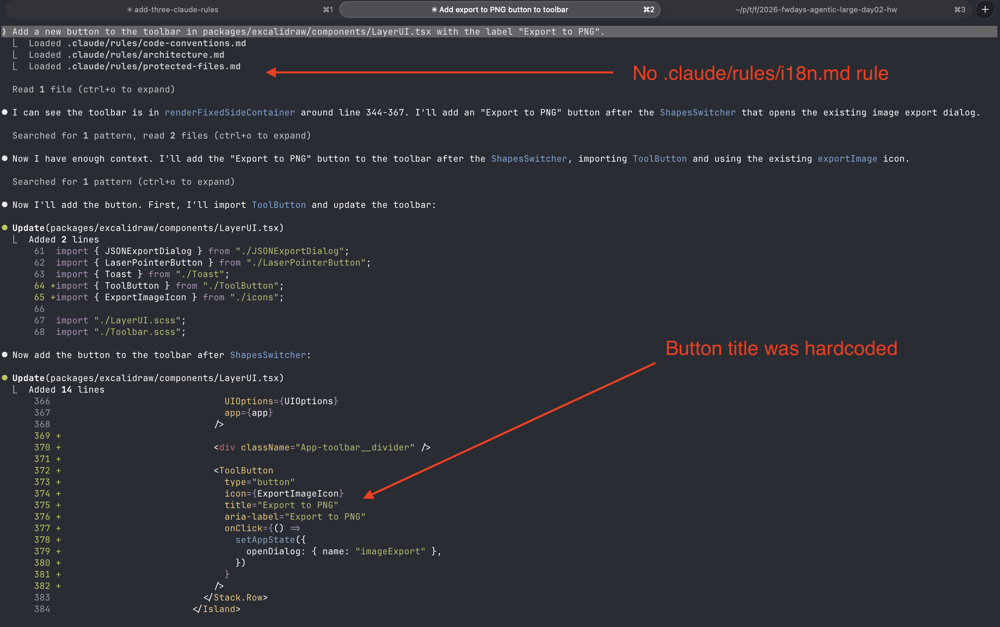
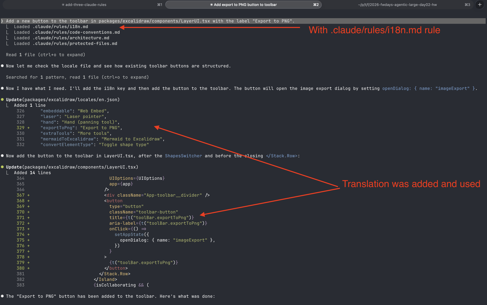

# A/B Test: `.claude/rules/i18n.md`

## Objective

Verify that the `i18n.md` rule influences Claude Code to use the translation function `t()` instead of hardcoding user-facing strings.

## Test Setup

**Prompt (identical in both runs):**

> Add a new button to the toolbar in packages/excalidraw/components/LayerUI.tsx with the label "Export to PNG".

**Variable:** presence of `.claude/rules/i18n.md`

## Results

### A — Without `i18n.md` rule

The rule file was renamed to `i18n.md.disabled` so Claude Code did not load it.

**Loaded rules:** `code-conventions.md`, `architecture.md`, `protected-files.md` (no `i18n.md`)

**Outcome:** Claude hardcoded the button label directly in JSX:

```tsx
title="Export to PNG"
aria-label="Export to PNG"
```

No changes were made to `en.json` or any locale file.



---

### B — With `i18n.md` rule

The rule file was restored. Claude Code loaded it alongside the other rules.

**Loaded rules:** `i18n.md`, `code-conventions.md`, `architecture.md`, `protected-files.md`

**Outcome:** Claude first added a translation key to `en.json`:

```json
"exportToPng": "Export to PNG",
```

Then used the `t()` function in the component:

```tsx
title={t("toolBar.exportToPng")}
aria-label={t("toolBar.exportToPng")}
```



---

## Conclusion

| Aspect | Without rule | With rule |
|--------|-------------|-----------|
| Loaded `i18n.md` | No | Yes |
| String handling | Hardcoded `"Export to PNG"` | `t("toolBar.exportToPng")` |
| `en.json` updated | No | Yes |
| i18n-compliant | No | Yes |

The `i18n.md` rule successfully steered Claude Code to follow the project's internationalization conventions. Without the rule, there was no indication that hardcoded strings should be avoided.
